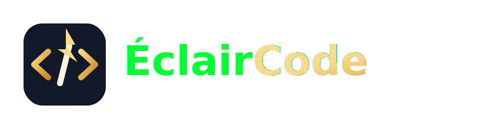

# 

## 🎯 The Ultimate Playground for DSA & LeetCode Enthusiasts

> **ÉclairCode** turns algorithm practice into a thrilling competition.  
> Solve, rank, and showcase your coding chops—all in one sleek, responsive hub.

---

### 🚀 Why Engineers Choose ÉclairCode?

| ✅ What You Get                       | 💡 How It Helps You                                                                  |
| ------------------------------------- | ------------------------------------------------------------------------------------ |
| **🔥 Real‑world DSA challenges**      | Sharpen the exact skills hiring managers hunt for.                                   |
| **🏆 Live global leaderboard**        | See your rank instantly, compete with peers, and earn brag‑worthy titles.            |
| **📊 Personal performance dashboard** | Track points, streaks, and progress over time with beautiful charts.                 |
| **🤝 Community & mentorship**         | Join Discord/Slack channels, discuss solutions, and get feedback from industry pros. |
| **🌗 Dark & Light modes**             | Code comfortably any time of day.                                                    |
| **📱 Fully responsive**               | Same powerful experience on desktop, tablet, or phone.                               |
| **💰 Free to start**                  | No hidden fees—just pure skill‑building.                                             |

---

### ✨ Core Features

- **Dynamic Problem Library** – Thousands of curated algorithm problems, sorted by difficulty, topic, and contest style.
- **Instant In‑Browser IDE** – Write, test, and submit code without leaving the platform.
- **Gamified Progress** – Points, badges, weekly challenges, and leaderboard filters (global, regional, friends).
- **Insightful Analytics** – Visualize accuracy, speed, and trend graphs on your personal dashboard.
- **Social Proof** – Export a shareable profile badge to embed on LinkedIn, GitHub, or personal sites.

---

### 📋 User Journey (Get Started in < 2 minutes)

1. **Sign up** – One‑click with Google or email.
2. **Pick a challenge** – Browse by tag (`#binary-search`, `#graph‑traversal`, etc.) or join a live contest.
3. **Code & submit** – The built‑in editor runs your solution against hidden test cases.
4. **Earn points & rank** – Watch your score jump on the leaderboard instantly.
5. **Track growth** – Open your dashboard to see streaks, improvement areas, and next‑level goals.

---

### 🌐 Join the Community

- **Discord & Slack** – Real‑time chat, solution walkthroughs, and mentorship.
- **Weekly Hackathons** – Compete for cash prizes, exclusive badges, and featured spotlights.
- **Blog & Tutorials** – Deep‑dive articles on algorithm patterns, interview prep, and performance optimization.

---

### 📣 Ready to Level Up?

Visit **[https://éclaircode.io](https://éclaircode.io)**, create your free account, and start climbing the ranks today!

> _ÉclairCode – where precision meets performance._  ⚡️ 🏅

## Code. Compete. Conquer.

> **ÉclairCode** is the premier online hub for engineers and developers who want to sharpen their skills, showcase their achievements, and accelerate their career growth.

---

### Why Choose ÉclairCode?

- **Real‑world coding challenges** – curated problems that mirror the complexities of modern software engineering.
- **Live leaderboard** – see where you stand among a global community of top performers.
- **Personal dashboards** – track your progress, point totals, and streaks in an intuitive, data‑rich UI.
- **Community & mentorship** – connect with peers, get feedback, and learn from industry experts.
- **Zero‑setup, instant access** – sign up, start solving, and watch your ranking rise.

---

### Core User Benefits

| Benefit                  | What It Means for You                                                                                          |
| ------------------------ | -------------------------------------------------------------------------------------------------------------- |
| **Skill Growth**         | Solve problems across a spectrum of difficulty, from beginner to expert, and receive instant feedback.         |
| **Career Visibility**    | Highlight your rankings and completed challenges on your profile – perfect for recruiters and hiring managers. |
| **Gamified Experience**  | Earn points, unlock badges, and compete in weekly contests for brag‑worthy recognition.                        |
| **Insightful Analytics** | Visual dashboards let you monitor your performance trends, streaks, and areas for improvement.                 |
| **Community Support**    | Join discussion threads, ask questions, and collaborate on solutions with like‑minded engineers.               |

---

### Key Features You'll Love

- **Dynamic Problem Library** – thousands of curated coding challenges covering algorithms, data structures, system design, and more.
- **Interactive Leaderboard** – filter by global, regional, or friends‑only rankings.
- **Personalized Dashboard** – see your points, recent submissions, and streaks at a glance.
- **Responsive Design** – seamless experience on desktop, tablet, and mobile devices.
- **Dark & Light Modes** – choose the visual style that fits your workflow.
- **Instant Feedback** – real‑time validation of your solutions with detailed explanations.

---

### Getting Started (User Journey)

1. **Create an account** – sign up with email or Google in seconds.
2. **Pick a challenge** – browse the problem library or join a themed contest.
3. **Code in‑browser** – write, test, and submit your solution directly on the platform.
4. **Earn points & rank** – see your score update instantly on the leaderboard.
5. **Track progress** – use your personal dashboard to monitor growth over time.

---

### Join the Community

- **Discord & Slack channels** for live discussion and mentorship.
- **Weekly hackathons** with cash prizes and exclusive badges.
- **Blog & tutorials** offering deep dives into algorithms, best practices, and interview prep.

---

### Ready to Elevate Your Coding Game?

🔗 **Live Demo:** https://eclaircode.vercel.app/  
Visit **[eclaircode.vercel.app](https://eclaircode.vercel.app/)**, sign up for free, and start climbing the ranks today.

Built by **Muhammad Salman Khan** – ✉️ alibinkhan465@gmail.com

---

_ÉclairCode – where precision meets performance._
